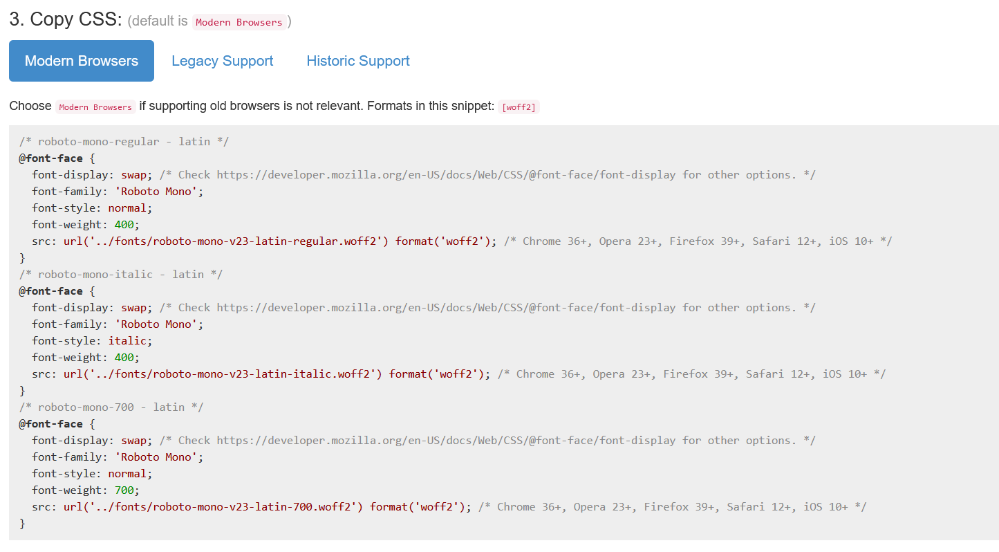

## Fonts
Fonts are weird over the web.\
as per [Astro Docs](https://docs.astro.build/en/guides/fonts/)
Specifically to astro, you can either place the font in the /public/fonts directory
of the astro project, or you can use a node module called [Fontsource](https://fontsource.org/) via `npm install @fontsource/<font-name>`

I would prefer to not install any node packages, as they always fail, especially
when there is another more native way of doing it.

So, I decided to install *Roboto Monospace* because it looked cool.\
Normally, I thought you would just go and download it from Google Fonts,
however, I learned that Google Fonts gives you .ttf fonts, and for the web, you 
need to use .woff files. To get around this, you can use *majodev/google-webfonts-helper*.\
SiteLink: https://gwfh.mranftl.com/ \
Github: https://github.com/majodev/google-webfonts-helper

This will allow you to download a .zip, which you may unzip to get a few .woff files.

Convieniently, the site also gives you the css:

Add all of this to the /src/styles/global.css file.\
It adds the fonts your avaliable fonts in the browser.

Then, we can add the font to the families that we use in tailwind.\
As a hack, I want all of my text to be monospace, however, because all default text 
in tailwind is of font-family: sans, we can add this monospace font to /tailwind.config.cjs:
```js
module.exports = {
	content: ['./src/**/*.{astro,html,js,jsx,md,mdx,svelte,ts,tsx,vue}'],
	darkMode: 'class',
	theme: {
		extend: {},
		fontFamily: {
			sans: ['Roboto Mono Variable', 'sans-serif'], // <<-- Add it here..
		},
	},
	plugins: [require('@tailwindcss/typography')],
}
```

